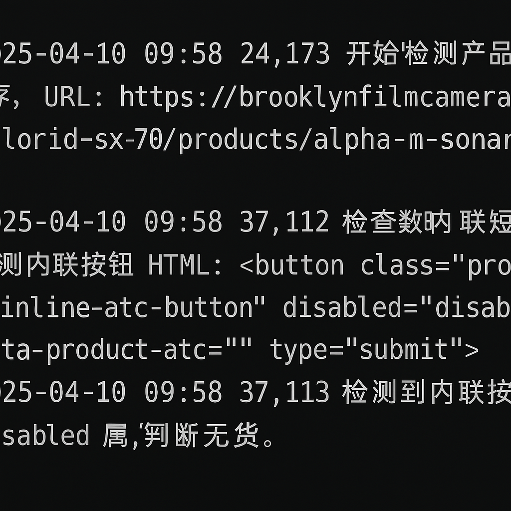
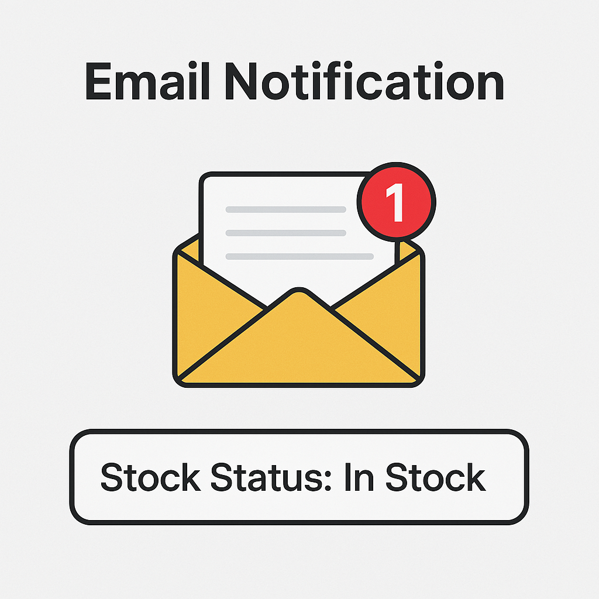
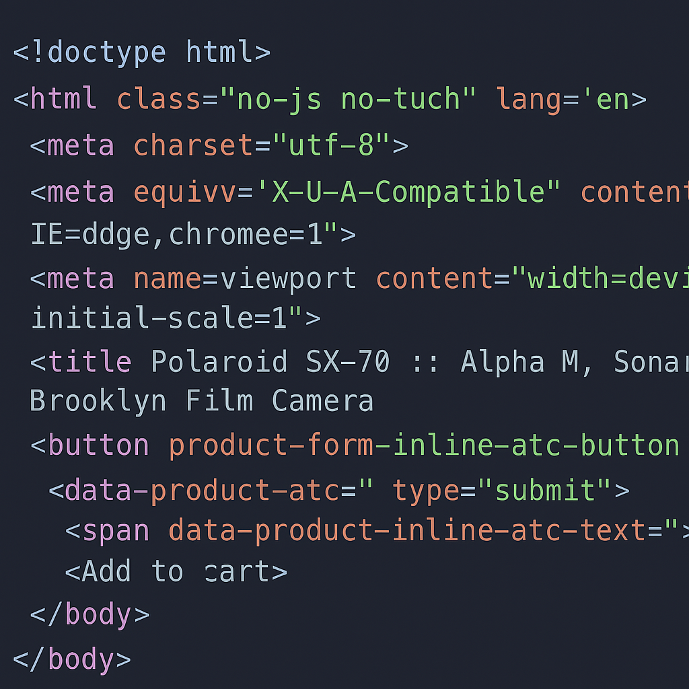
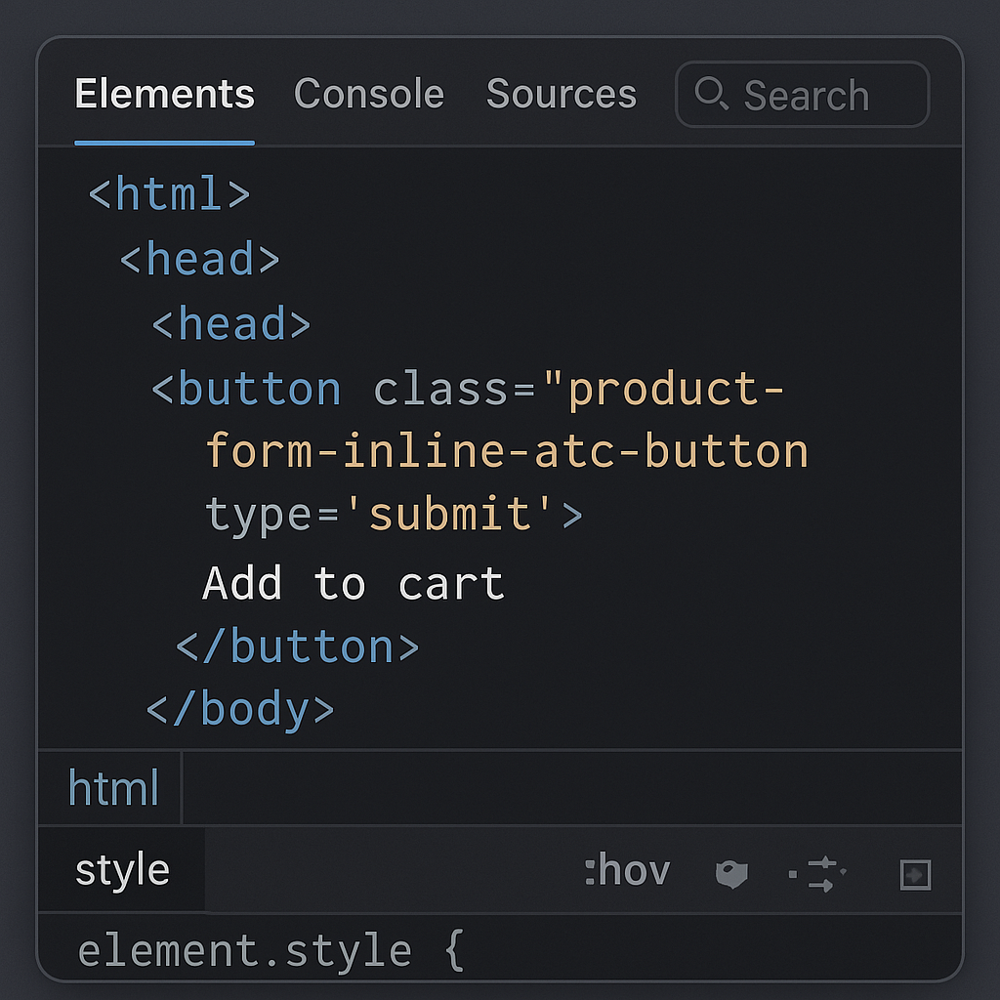

<h1 align="center">📸 Alpha Stock Checker</h1>

<p align="center">
  <i>一套基于 GitHub Actions 的智能库存监控系统，支持网页状态自动判断 + 邮件通知，助你秒杀心仪好物。</i>
</p>

---

## 🚀 功能特性

- 🔄 自动定时检测网页库存状态（Selenium + Headless Browser）
- 📬 有货自动邮件提醒（支持 QQ 邮箱）
- 🌐 GitHub Actions 云端定时运行
- ✅ 多浏览器兼容（Edge/Chrome）
- 🔐 安全使用 Secrets 管理私密信息

---

## 🖼️ 项目演示图

### 🧐 控制台输出
<p align="center">
  
</p>

### 📬 邮件通知样式
<p align="center">
  
</p>

### 🧪 页面检测状态
<p align="center">
  
  
</p>

---

## 🛠️ 项目结构

```bash
alpha-stock-checker/
├── .github/
│   └── workflows/
│       └── check_stock.yml      # Actions 自动运行配置
├── check_stock.py               # 主检测逻辑（含 Selenium）
├── mail_utils.py                # 邮件发送模块
├── requirements.txt             # Python 依赖清单
├── trigger.txt                  # 用于触发 Actions 的占位文件
└── README.md                    # 当前文件
```

---

## ⚙️ 环境变量支持列表 (GitHub Secrets)

| 名称 | 示例值 |
|------|--------|
| `STOCK_URL` | `https://example.com/product` |
| `NOTIFY_EMAIL` | `your_email@example.com` |
| `SMTP_HOST` | `smtp.qq.com` |
| `SMTP_PORT` | `465` |
| `SMTP_USER` | `your@qq.com` |
| `SMTP_PASS` | `授权码` |
| `SENDER_EMAIL` | `your@qq.com` |

---

## 📆 GitHub Actions 定时触发说明

```yaml
on:
  schedule:
    - cron: "*/30 * * * *"  # 每 30 分钟触发一次（UTC 时间）
```

> ✅ 自动触发记录将以 "Scheduled" 显示在 Actions 页面。

---

## 🛠️ 环境变量配置

请复制 `.env.example` 为 `.env` 文件，并填写你的私密配置。

项目会自动加载 `.env` 文件，或在 GitHub Actions 中使用 Secrets。

---

## ❤️ 鼓励验证

- [Selenium](https://www.selenium.dev/)
- [GitHub Actions](https://docs.github.com/en/actions)
- [BeautifulSoup](https://www.crummy.com/software/BeautifulSoup/)
- [Python Webdriver Manager](https://github.com/SergeyPirogov/webdriver_manager)

---

<p align="center">
  <b>Have fun, stay stocked.</b> 🛒✨
</p>
